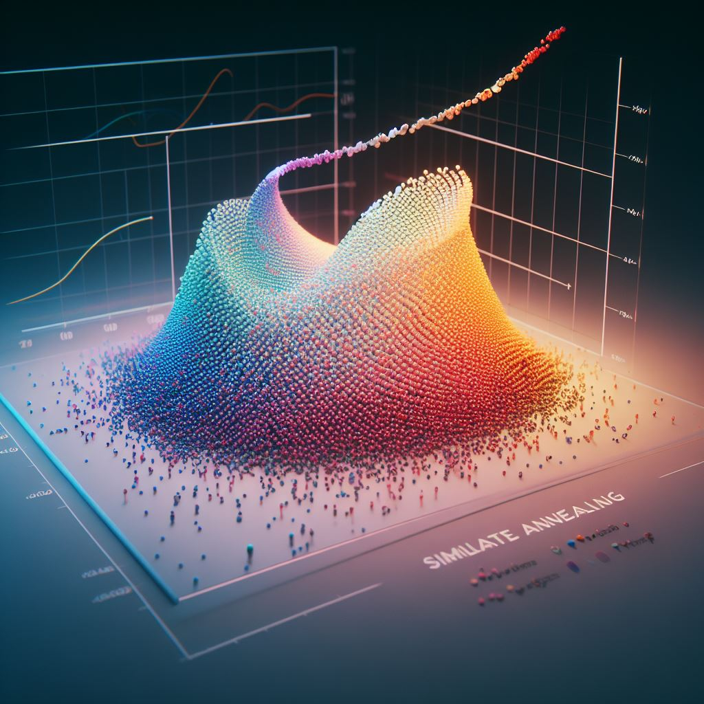
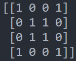
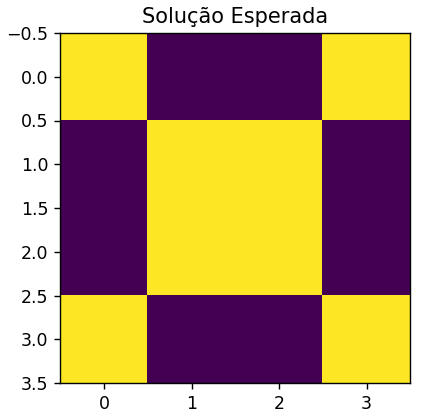

# Simulated Annealing

Este projeto teve como objetivo criar uma aplicação simples e visual da meta-heurística Simulated Annealing no contexto de processamento de imagens.

A partir de uma matriz que representa uma figura, o algoritmo aos poucos converge para a figura em questão, e é possível verificar todo o processo de conversão executado pelo algoritmo.

O algoritmo utilizado é baseado no artigo original proposto por [Kirkpatrick et al. (1983)](https://www.science.org/doi/10.1126/science.220.4598.671)

Também é possível encontrar mais explicações a respeito da meta-heurística Simulated Annealing aqui: [2](https://pt.wikipedia.org/wiki/Simulated_annealing)

## Aplicação:
Suponha uma matriz binária 4x4.

Se convertermos esta matriz para uma imagem, temos a imagem a seguir. Cada 1 na matriz é um quadrado amarelo e cada 0 um quadrado roxo.

Agora imagine, será que utilizando a meta-heurística Simulated Annealing é possível convergir para a mesma matriz vindo de uma outra matriz totalmente aleatória?

Sim, é possível, conforme podemos verificar no vídeo abaixo:

## Como utilizar?
Para utilizar o código, você pode seguir estes passos:

- 1 - Clone o respositório
    -git clone https://github.com/rafaelgard/Simulated-annealing.git

- 2 - Crie um ambiente virtual:
    - py -m venv env

- 3 - Instale as dependências
    - pip install requirements.txt

- 4 - Caso você queira utilizar na geração de outra figura, basta apenas alterar a variável "solução", rodar o código e verificar o resultado.

## Conclusões:
Com este projeto, é possível aplicar a meta-heurística Simulated Annealing no contexto de imagens com facilidade e também adaptar o código para problemas maiores.
